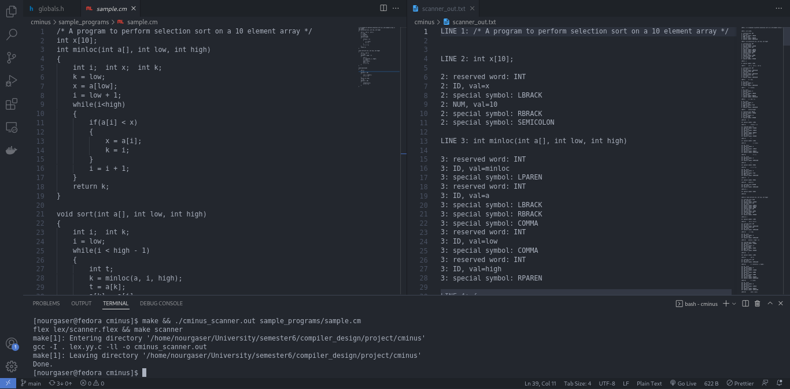

# Compiler Design Project (CS-352, Spring 2022, MUST University)
## Terminology & Prerequisites:

- Reference book: [Compiler Construction: Principles and Practice](https://www.amazon.com/Compiler-Construction-Principles-Kenneth-Louden/dp/0534939724), by Kenneth C. Louden.

- [The Tiny Machine](https://www.amazon.com/Compiler-Construction-Principles-Kenneth-Louden/dp/0534939724): a simulator in C for the Tiny Machine; a program that executes custom assembly [*.tm](tm/sample.tm) files. Its source code is provided in the book's appendix C.

- The Tiny programming language: a very simple programming language ([keywords and rules](docs/img/tiny_rules.png) specified at p.22 of the book).

- Tiny Compiler: a Tiny->TM compiler. Its [source code](tiny) is provided in the book's appendix B.

- The C- (C minus) programming language: a simple programming language that is a subset of the C programming language. Its [structure, grammar, and rules](docs/img/cminus_grammar.png) are specified at appendix A of the book. 


## Project Goal

This project's main task is to implement the first two phases of a compiler that compiles C- source code into TM assembly which can be excuted on the TM Machine.


- Phase I: scanner (lexical analyzer).

- Phase II: parser (syntax analyzer).


## Implementation
The scanner is implemented by specifying C-'s tokens using regex for LEX to generate the scanner in C.<br>
The parser is implemented by specifying C-'s grammar using the BNF notation for YACC to generate the parser in C.

## How to Use
Clone this repo and cd to it: 
```bash 
git clone https://github.com/nourgaser/CMinusCompiler && cd CMinusCompiler
```
### Tiny Compiler
cd to [`tiny`](tiny) and compile using the Makefile.
```bash
cd tiny/ && make
```
You should now see a `tiny_compiler.out` excutable file. Create a `.tny` file and add your TINY language code to it, or simply test with the sample file included [sample.tny](tiny/sample.tny).
```bash
./tiny_compiler.out sample.tny
```
This will print logs from various stages of the compilation, and you'll see your output TM assembly file, `sample.tm`. Use the Tiny Machine to excute it.
### Tiny Machine 
cd to [tm](tm) and compile using the Makefile.
```bash
cd tm/ && make
```
You should now see a `tm.out` excutable file. Create a `.tm` file and add your Tiny Machine assembly code to it, or simply test with the sample file included, [sample.tm](tm/sample.tm). (Or use the output `sample.tm` file you got from your Tiny Compiler!)
```bash
./tm.out sample.tm
```
### C- (C Minus)
#### Only the scanner for C-Minus was implemented; as instructed by the project's updated requirements. (Feel free to contribute and implement the rest).
cd to [cminus](cminus) and use the Makefile to generate the excutable scanner.
```bash
cd cminus/ && make
```
You should now see a `cminus_scanner.out` excutable file. Create a `.cm` file and add your C-Minus source code to it, or simply test with the sample file included, [sample.cm](cminus/sample_programs/sample.cm). Pass your `.cm` file to it:
```bash
./cminus_scanner.out sample_programs/sample.cm
```
If all goes well, you should see a log saying 'Done.', and an output file `scanner_out.txt` containing the result of the scanning phase of the C-Minus compiler.



## Team Members
| Name        | ID           |
| ------------- |:-------------:|
| [Nour Gaser](https://github.com/nourgaser)      | 89553      |
| [Ahmed Gomaa](https://github.com/ahmedgomaa)      | 89392      |
| [Ahmed Khaled Kira](https://github.com/ahm3dkira)      | 89671      |

## Credits
- The source code for the TM Machine, and Tiny Compiler can be found in Louden's book, and at [ejacky's repo: tiny](https://github.com/ejacky/tiny) as well. 
